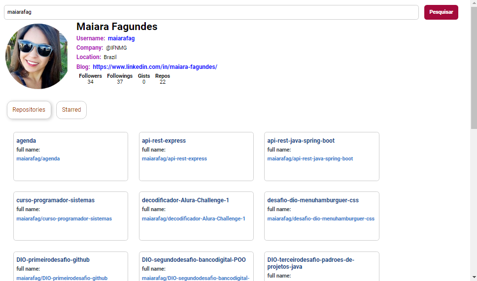

<h1 align="center">React App Interface GitHub </h1>

React App Interface de pesquisa no GitHub 

 
 <a href="#sobre">Sobre</a> •
 <a href="#objetivo">Objetivo</a> •
 <a href="#tecnologias">Tecnologias</a> • 
 <a href="#pre-requisitos">Pré Requisitos</a> • 
 <a href="#demonstracao">Demonstração</a>
 

# Sobre

Interface feita com React App para GitHub  

# Objetivo

 Pesquisar username do usuário e mostrar seu perfil no GitHub

# Tecnologias

Foi usado na construção do projeto:

- [Reat](https://pt-br.reactjs.org/)
- [JavaScript](https://www.w3schools.com/javascript/)
- [HTML](https://www.w3schools.com/html/)

# Pre-requisitos

Ter instalado em sua máquina as seguintes ferramentas:

•  Editor de Trabalho VSCode e Node.js

# Demonstracao

<h1 align="center">
  
</h1>
