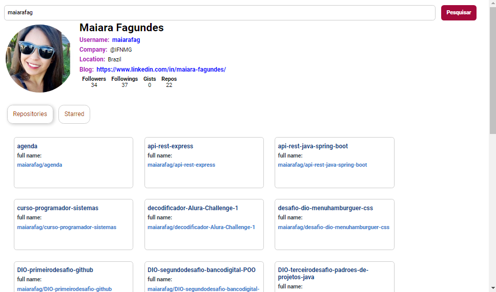

<h1>React App Interface GitHub </h1>

React App Interface de pesquisa no GitHub 

# Objetivo

 Pesquisar username do usuário e mostrar seu perfil no GitHub

# Tecnologias

Foi usado na construção do projeto:

- [Reat](https://pt-br.reactjs.org/)
- [JavaScript](https://www.w3schools.com/javascript/)
- [HTML](https://www.w3schools.com/html/)

# Pre-requisitos

Ter instalado em sua máquina as seguintes ferramentas:

•  Editor de Trabalho VSCode e Node.js

# Resultado

<h1 align="center">
  
</h1>
